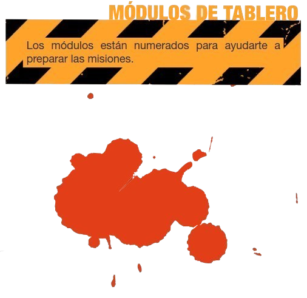

# Preparación

1. Elige una mision.
2. Coloca los modulos de tablero
3. Coloca las puertas, los coces y objetibos.
4. Pon aparte las cartas de Gemelas Malvadas, Escopeta de Mamá, Cóctel Molotov, Sartén y Herida. Reserva también una única carta de Hacha de bombero, Palanca y Pistola
5. Crea un mazo con las cartas de Zombi y otro con las cartas de Equipo, y a continuación colócalos bocabajo, cerca del tablero de juego.
6. Después, cada jugador elige a sus supervivientes: &#x20;
   * 1 jugador: 4 Supervivientes.&#x20;
   * 2 jugadores: 3 Supervivientes por jugador.&#x20;
   * 3 jugadores: 2 Supervivientes por jugador.
   * 4 a 6 jugadores: 1 Superviviente por jugador.
7. Para cada Superviviente, coloca un contador en la primera casilla de la zona azul de la barra de Peligro, y otra en la primera Habilidad que corresponda.
8. Reparte al azar el Equipo inicial: un Hacha de bombero, una Palanca y una Pistola. Eso es todo, chicos; si hay más Supervivientes que armas iniciales, bueno, es una pena… A modo de consuelo, todos los demás reciben una Sartén.

<figure><figcaption></figcaption></figure>
